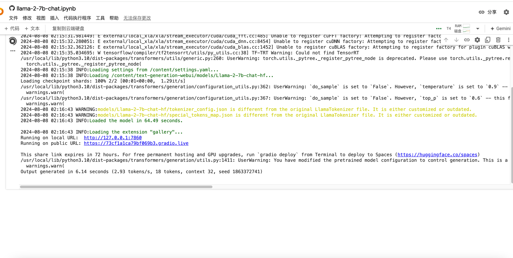
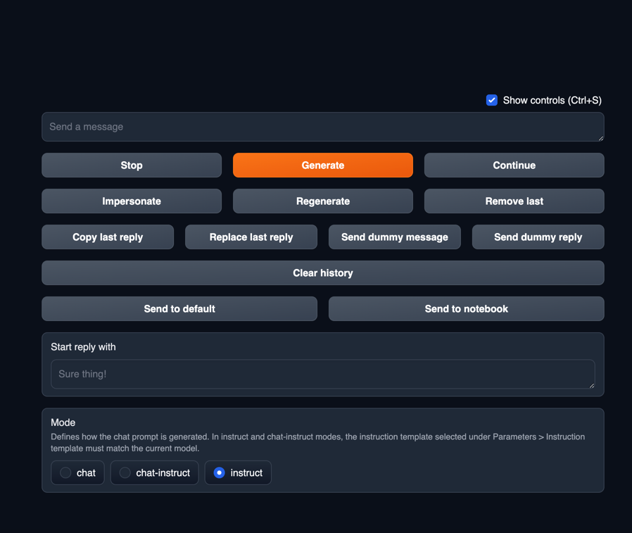

## llama-2-7b-chat

This llama2 model is used to train intelligent chat robots. 

It can also be used as an enterprise's intelligent customer service.

You can train it according to your own needs!

### colab research

If you don’t have your own server, you can also use the free computing power provided by colab to run the intelligent training model.

* [llama-2-7b-chat](https://colab.research.google.com/github/camenduru/text-generation-webui-colab/blob/main/llama-2-7b-chat.ipynb#scrollTo=VCFOzsQSHbjM)

the result:

